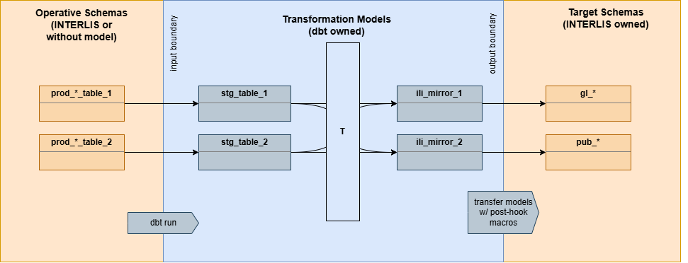

# Table of Contents


<!-- @import "[TOC]" {cmd="toc" depthFrom=1 depthTo=6 orderedList=false} -->

<!-- code_chunk_output -->

- [Table of Contents](#table-of-contents)
- [Accessing the Development Environment](#accessing-the-development-environment)
- [Overall Workflow](#overall-workflow)
- [Docker Setup](#docker-setup)
  - [Building the devcontainer image](#building-the-devcontainer-image)
  - [dbt devcontainer](#dbt-devcontainer)
    - [First time setup](#first-time-setup)
  - [PostGIS Container](#postgis-container)
    - [First Time Setup](#first-time-setup-1)
      - [Using the image in development/testing](#using-the-image-in-developmenttesting)
- [dbt](#dbt)
  - [Setting up a new dbt Project](#setting-up-a-new-dbt-project)
    - [Model Directory Structure](#model-directory-structure)
    - [Setting up dbt schema](#setting-up-dbt-schema)
  - [dbt Workflow](#dbt-workflow)
    - [Boundary Model Generation](#boundary-model-generation)
      - [Transfer Models](#transfer-models)
    - [Deployment](#deployment)
      - [Windmill](#windmill)
    - [The dbt-INTERLIS Boundary](#the-dbt-interlis-boundary)
      - [Catalogues](#catalogues)
      - [Baskets](#baskets)
    - [Macros](#macros)
      - [Available Macros](#available-macros)
      - [Debugging Macros](#debugging-macros)
    - [Extensions](#extensions)
      - [Power User for dbt Extension](#power-user-for-dbt-extension)
      - [dbt Flow Lineage Extension](#dbt-flow-lineage-extension)
  - [Docs](#docs)
    - [Customizing Docs Overview Page](#customizing-docs-overview-page)
    - [Hosting dbt Docs](#hosting-dbt-docs)
  - [Importing Schemas to localhost DB](#importing-schemas-to-localhost-db)
- [Other Tools used in this Project](#other-tools-used-in-this-project)
  - [Colibri](#colibri)
- [Known issues](#known-issues)
- [Troubleshooting](#troubleshooting)
      - [post-hook macro call fails unless defined as string](#post-hook-macro-call-fails-unless-defined-as-string)
      - [There are problems highlighted (often in dbt_project.yml) that I've already solved.](#there-are-problems-highlighted-often-in-dbt_projectyml-that-ive-already-solved)
      - [PostgreSQL Permission Gotchas](#postgresql-permission-gotchas)
- [TODO](#todo)

<!-- /code_chunk_output -->

# Accessing the Development Environment

The development environment for working on dbt projects has been packaged into the docker container setup described by the files in the `.devcontainer` directory at the project's root. The containers are set up on a remote virtual machine that can be accessed via vscode and its 'remote ssh' extension:

```
Remote VM connection details:
gisdev@172.29.41.108
```

If there is ever a need to set the development environment up somewhere else, the section [Docker Setup](#docker-setup) has more info. 

The postgis-container used for prototyping can be accessed under the same IP.


# Overall Workflow

The most common use-case is, that a new transformation has to be defined from one schema to another. I'll outline how that tends to happen. Everything described here uses the remote VM decribed in the [previous section](#accessing-the-development-environment) that's alreay set up and ready for use. For each of the steps below, you'll find more information in the later sections.

1) [Create a new dbt project](#setting-up-a-new-dbt-project), if there isn't already one for the topic
2) Generate staging and target dbt models aka [boundary models](#dbt-workflow)
3) Write transformations to get from staging models to mirror model


# Docker Setup
## Building the devcontainer image

note that when building the image, the `USER_UID` and `USER_GID` of the user that will be using the container need to be passed with the docker build command like this:

```shell
$ docker build --build-arg USER_UID="$(id -u)" --build-arg USER_GID="$(id -g)"  . -t dbt_image:latest
```

## dbt devcontainer
The dbt Core image is the development environment for this project. As such, is run by VS Code when opening the directory in the configured devcontainer.

The source files are mounted onto the dev container (./src/dbt).

### First time setup

Save DB the password for the testing DB in environment variable `DB_PASSWORD`. 
```bash
echo 'export echo 'export DB_PASSWORD="postgres"' >> ~/.bashrc="postgres"' >> ~/.bashrc
```
Afterwards, reload window (`Ctr` + `Shift` + `P` > `Reload Windown`)


## PostGIS Container

For developing and testing transformations completely off the live databases, this development environment includes a postgis server. Here, backups of schemas from the live databases can be restored onto to prototype new projects.

Using image: `postgis/postgis:16-3.5-alpine`
- PostgreSQL version 16.13: Higher than version 16.10 that is used in production (backwards compatible)
  - pg_dump version 16.13 
- PostGIS version 3.5, same as on live servers


### First Time Setup

When the project root directory is openend for the first time through vscode devcontainers, the postgis-container is automatically set up with the user `postgres` and passord `postgres`.

> ℹ️ _**Note:**_ 
For new databases created, **postgis** and **uuid-ossp** extensions need to be added: Right click on `Extensions` category in the pgAdmin browser pane.

#### Using the image in development/testing

The image `postgres:latest` is just the base state after initial setup. The configured test database is continually being saved to `postgres:dev`.

> ⚠️ _**Warning:**_ 
Careful about using the VsCode command _'Rebuild and reopen in container'_ without first committing the changes made on the postgres container to the `postgres:dev` image. Run the command `Reload window` from the VS Code command pallete, to get rid of the highlighted issues. 


# dbt

dbt is the transformation modelling framework used in this development environment. This section talks about how it is used within the context of our use-case.

## Setting up a new dbt Project
Open the /src/dbt directory within the dbt devcontainer and run
```
dbt init --skip-profile-setup
```

This sets up the project directory structure. We are skipping the interactive profile setup with `--skip-profile-setup`, since we are using our own templates.

### Model Directory Structure

In the `models` directory, we differentiate between `transformations` and `audits`. Transformations being the models concerned with doing the main data transformation work, and audits being models that offer observability to the changes made by those transformations.
Inside each of those categories, models are grouped into `staging` or the job they belong to (`export` and `import` in the example below). A staging model is one that takes an external source and normalizes it with regards to column names and data types, preparing it for use in the job-specific models. 


``` 
models
├── audits
|   ├── audit_staging
|   ├── export
|   └── import
└── transformations
    ├── staging
    ├── export
    └── import
```

### Setting up dbt schema

1) create roles referenced in backup file 
2) retore backups of schemas we want to develop for
3) set up dbt_schema
  - create `dbt_<topic>` schema
  - add `t_ili2db_seq` to schema

Some utility macros have been written to speed up setting up local test environments:
(Currently part of the `ili_utils` package. Should maybe be split off)

| Macro | Usage |
| ----- | ----- |
| setup_roles_for_schema | set up read and write roles to mirror 
| create_ili_sequence | set up t_ili2db_seq for given schema |


## dbt Workflow
dbt (data build tool) is a data first transformation framework. What I mean by 'data first', is that dbt is set up to build up transformation layers from the ground up. Transformation models are just `SELECT` queries, so a model is valid only if you can actually run this query. As opposed to something like `CREATE TABLE`, where you would create an abstract container for data you don't have in the required form yet.\
Since we do have a very clear endpoint for our transformations in our use-case - the target INTERLIS Schema - it is helpful to have your start and end points set up, i.e. the staging models of the source schema and the models that define the structure we have to get the data into. The latter is what we refer to as 'ili_mirrors'. 



The graphic above depicts the boundaries of what is managed by dbt vs ITNERLIS and the models that make up that boundary: staging (stg_) and mirror (ili_mirror_) models.

<!-- TODO: Document the fact that you need to add sources.yml somewhere -->
<!-- TODO: Document tests somewhere -->


### Boundary Model Generation

To save ourselves writing out a bunch of boilerplate dbt models, a [python script](src/python/generate_ili_mirror_models/generate_models.py) was written, that can be used to set up both ends of the dbt boundary to existing schemas it doesn't own:

```
$ python3 generate_models.py -h
usage: generate_models.py [-h] --schema-name SCHEMA_NAME [--output-path OUTPUT_PATH] [--table-name TABLE_NAME] [--source-mode]

Create dbt models that make up boundary layer to INTERLIS target schema. Can also create staging models using the --source-mode flag.

options:
  -h, --help            show this help message and exit
  --schema-name SCHEMA_NAME, -t SCHEMA_NAME
                        Name of the target schema to create boundary models for.
  --output-path OUTPUT_PATH, -o OUTPUT_PATH
                        Path to output directory for generated files.
  --table-name TABLE_NAME, -n TABLE_NAME
                        Optional: Name of table to generate model for. If omitted, models are build for ALL tables in the schema.
  --source-mode, -s     Optional: Generate a source model instead of a target model.
```

Example usage:
```
python3 generate_models.py --schema-name ch_kt_biotope_linien -o /project/src/dbt/dbt_biotope/models/transformations/export_to_mgdm/uebrige_biotope_linien
```

The generated `ili_mirror` models give you a clear end-point for building your transformatin towards including what data types the columns must have by that point as well as whether there is a `NOT NULL` constraint:

```sql
{{ config(materialized='table', enabled=false) }} 

SELECT 
  t_id::bigint, -- NOT NULL
  t_basket::bigint, -- NOT NULL
  t_ili_tid::character varying(200), 
  kanton::character varying(255), -- NOT NULL
  objnummer::character varying(30), -- NOT NULL
  aname::character varying(80), 
  bio_typ::bigint, 
  bio_typ_kt::character varying(80), 
  herkunft::character varying(250), -- NOT NULL
  kartierungsgrundlage::bigint, 
  aufnahmedatum::date, 
  mutationsdatum::date, 
  mutationsgrund::text, 
  mutationsgrund_de::text, 
  mutationsgrund_fr::text, 
  mutationsgrund_rm::text, 
  mutationsgrund_it::text, 
  mutationsgrund_en::text, 
  bedeutung::bigint 
FROM {{ ref('placeholder') }}
```

The models start out as disabled (`enabled=false`), to avoid the dbt compiler tripping over the currently invalid model on account of not having a real data source (`FROM {{ ref('placeholder') }}`).

#### Transfer Models
The boundary model generation also includes transfer models. These models handle the transfer of the dbt-owned mirror model to the INTERLIS-owned target schema. Since dbt models can only be `SELECT`-statments, the actual transfer logic runs as [post-hooks](https://docs.getdbt.com/reference/resource-configs/pre-hook-post-hook). Macros from the custom dbt package [ili_utils](https://github.com/ayomeer/dbt_ili_utils/tree/main/macros) are used:

```SQL
-- depends_on: {{ ref('prepare_target_ch_kt_trockenwiesen') }}
-- depends_on: {{ ref('write_to_kt_trockenwiese') }}

{{ config(
  enabled=var('enable_transfer', false),
  post_hook=[
    '{{ ili_utils.insert_into(
      schema_name="ch_kt_trockenwiesen", 
      table_name="kt_trockenwiese_teilobjekt"
    )}}'
  ]
)}}

SELECT * FROM {{ ref('ili_mirror_kt_trockenwiese_teilobjekt') }}
```

The `depends_on` comment, is actually is parsed by dbt and explicitly forces a dependency in the DAG, even when there is none it can infer from the data. It is used here to ensure the correct order of transfers, e.g. parent table before child table.

Transfer models are their own seperate models, so they can be configured to be disabled by default for safety. `var('enable_transfer', false)` enables them if `--vars 'enable_transfer: true'` is used when running the transformation job. 


### Deployment

```bash
dbt run  --vars '{reset_target: true, enable_transfer: true}'
```

#### Windmill

On Windmill, the script "dbt run transform" can be used to run dbt models on the live IAP DB. It uses the `windmill-iap` profile output, which can be defined in the project's `profiles.yaml` like this:

```yaml
    windmill-iap:
      host: srv-gisiap-02.glnet.ch
      dbname: glarus
      pass: "{{ env_var('DB_PASSWORD') }}" 
      port: 5432
      schema: dbt_quellkataster
      threads: 1
      type: postgres
      user: gisuploadmanager # <-- subject to change
  
```

**git tags for windmill**

dbt packages used in the project are not part of the project's source tracked by git. This is so the commit history stays focused on the source of the actual project, rather than getting polluted with hundreds of files changing, when dbt package files change. These packages can simply be pulled on demand using the `dbt deps` command.\
The windmill runner currently does not have access to the dbt package hub however, so as a workaround we're creating git tags that include the dbt package dependencies. The script[create_wmill_release_git_tag.sh](create_wmill_release_git_tag.sh) at this project's root was written to automate this process. The steps it runs are:

1) Remove .git directory from any dbt_packages that are pulled directly through git
2) Add dbt_packages to git source
3) Commit
4) Add release tag
5) Explicitly push tag (not pushed with regular push command)
6) remove dbt_packages from tracked files again


### The dbt-INTERLIS Boundary

The main objects that need managing are baskets and catalogues.

#### Catalogues

For Catalogues we are relying on INTERLIS' existing mechanisms to import and export catalogues as much as possible. This keeps the tranformations simpler and philosophically, catalogues are closer to static schema structure than data transformation anyways.

#### Baskets
The only thing that the dbt transformations need to know about the basket setup of the target INTERLIS schema is what `t_id` to write into the `t_basket` column of data records. This information is added to the respective dbt project's `dbt_project.yml` file as a variable under the `vars` tag. For example in the project 'dbt_ersatzbiotope' the basket t_ids corresponding to the target baskets is defined for both export jobs like this:

```yaml
vars:
  export_config:
    gl_ersatzbiotope_data_basket_tid: 36
    pub_gl_ersatzbiotope_data_basket_tid: 6

```

and used in ili_model select statements like this:

```SQL
'{{ var('export_config')['gl_ersatzbiotope_data_basket_tid'] }}'::bigint as t_basket,
```


### Macros
Macros are basically templated SQL-scripts to make common tasks reusable. Two dbt packages have been created to package together such tasks:

- **ili_utils**: Helper macros for handling the boundary between dbt models and INTERLIS Schemas.
- **audit_utils**: Companion package to the `audit_helper` package, adding on some functionality for specific use-cases. 

#### Available Macros

See `ili_utils` and `audit_utils` in documentation. It is embedded into the hosted docs of any project that uses it.


#### Debugging Macros

A big drawback of the current post-hook approach to writing the ili_mirrors to their targets, is that the SQL generated by macros in post-hooks does not show up in the compiled models.

The most reliable way to see what macros actually compile to is to look at `logs/dbt.log`. This is the only place, where even post-hook statements get fully expanded.

Simple macros that don't rely on being called in post-hooks can be debugged by calling them in an analysis model and compiling it. 


### Extensions
#### Power User for dbt Extension

- Model documentation yaml files -> generate w/ Documentation Editor in bottom pane (part of Power User for dbt extension)

Conditions for Documentation Editor to work as expected:
- Model needs to exist on database -> `dbt run --select <model_name>`


#### dbt Flow Lineage Extension

Conditions for lineage graph to look as expected:
- `dbt compile` and `dbt docs generate` have been run
- model columns are documented in yaml file


## Docs

To view graphs and lineage information, use the docs:

```
dbt docs generate
dbt docs serve --port 0
```

> ⚠️ **_Important:_** The default port, 8080, is used by vscode devcontainer!
`--port 0` ensures, that a free port is used. 

### Customizing Docs Overview Page

To customize the dbt docs landing page, simply add a file called `Overview.md` to the dbt project models directory. 

<!-- TODO Add template -->


### Hosting dbt Docs

Once GitLab is available, dbt docs can be hosted there. For now, we're using [Netlify](https://app.netlify.com/teams/ayomeer/projects) to host the static dbt docs pages.

The entry-point for the user to get an overview of 

## Importing Schemas to localhost DB

> ⚠️ **_Important:_** Make sure postgis and uuid-ossp extensions are present on DB!

1) Backup from live DB as plain w/ UTF8 formatting
2) Prepare roles referenced in plain backup file
3) import on localhost DB by right clicking **database** (not schema) and choosing 'Restore...' or using command line (on host): `psql -h localhost -p 5432 -U postgres -d test_db -f prod_gl_biotope_20260402.sql`


# Other Tools used in this Project

## Colibri
Colibri is a data introspection tool with the main feature (for us) being column level lineage:

<!-- TODO: Image of interesting example -->

The prerequisite for column-level lineage to work is, that all models in the DAG have yml documentations. These can easily be generated through the "Documentation Editor" tab in the bottom pane of the vscode workspace once the dbt models exist on the database (i.e. `dbt run` successfully run).

# Known issues

- dbt macro log messages get printed even when models aren't run, but only parsed. This also means, when building or running jobs, log messages appear 


# Troubleshooting

#### post-hook macro call fails unless defined as string

Usually, we like to call macros like this

```sql
{{ config(
  enabled=var('enable_transfer', false),
  post_hook=
    ili_utils.insert_into(
      schema_name="ch_kt_auengebiete", 
      table_name="kartierungsgrundlage_catalogue"
    )
)}}
```

because it looks nice and readable. This will fail however with an undescriptive error like 

```
Error at line 7 at ')'
```

This is due to `ili_utils.insert_into` using `{{this}}` in the macro. For some reason `{{this}}` does not resolve correctly when calling macros like this. It does though, when you define the macro call as a string like this:

```sql
{{ config(
  enabled=var('enable_transfer', false),
  post_hook=
    '{{ ili_utils.insert_into(
      schema_name="ch_kt_auengebiete", 
      table_name="kartierungsgrundlage_catalogue"
    )}}'
)}}
```

dbt devs actually recommend and encourage you to write hook macro calls as strings in the documentation:
https://docs.getdbt.com/best-practices/dont-nest-your-curlies?version=2.0&name=Fusion#an-exception

This is also further described here:
https://github.com/dbt-labs/dbt-core/issues/3986

#### There are problems highlighted (often in dbt_project.yml) that I've already solved.
Try running `dbt compile` + Command Palette > Reload Window 

#### PostgreSQL Permission Gotchas
- if a view doesn't have the same permissions as the table from which the data ultimately derives from, you get permission errors. Even if the user trying to access it is part of both roles but they don't match.

# TODO

- [v] Python script to create boundary models including datatypes from pg information_schema
- [ ] Add generation of schema.yml files that document ili_mirror models and add NOT NULL tests to `t_ili_tid`, since it's not necessarily enforced by the target schema but Model Baker Data Validator _does_ expect it to be NOT NULL.

- [ ] Custom version of dbt init -> when starting next project
  - generate dbt_project.yml template with
    - templates for datasets and baskets
    - run_start sequence reset
    - seed delimiter
    - data_t_id_offset
    - select grants
  
  - generate profiles.yml in dbt project root
    - profile name matching profile set in dbt_project.yml
    
  - Custom `models/overview.md` template for docs

